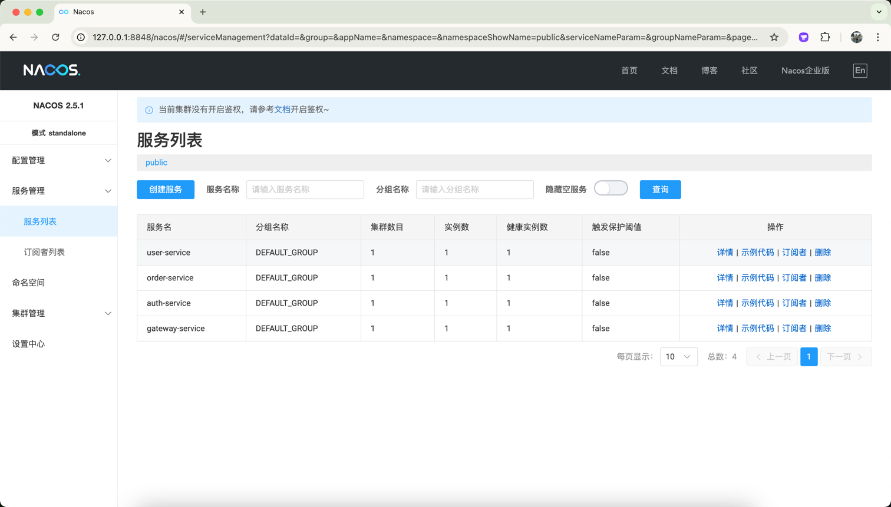
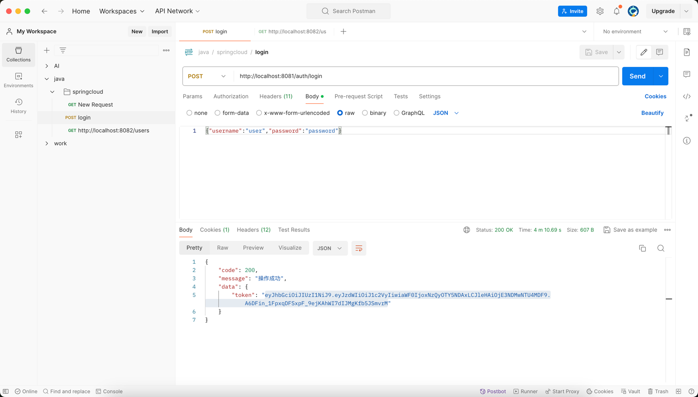
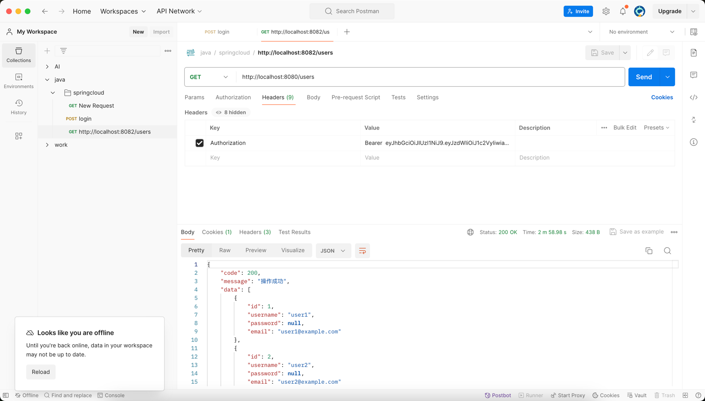
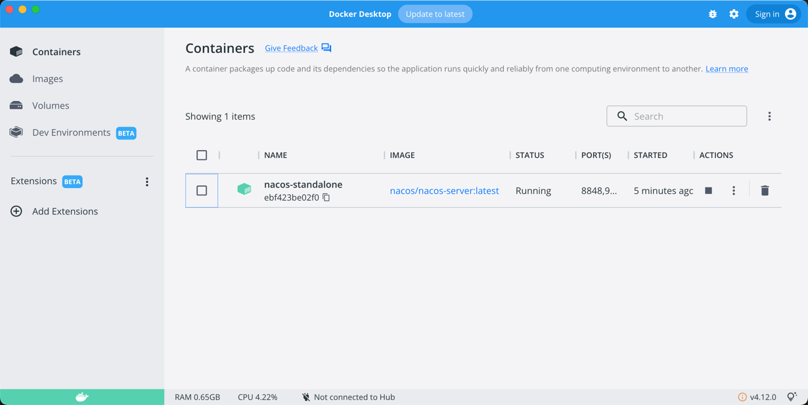

# Spring Cloud 微服务实践

这是一个基于Spring Cloud的微服务架构示例项目，展示了微服务架构的核心组件和基本功能。项目代码托管在 [Rodert/SpringCloud-Demo](https://github.com/Rodert/SpringCloud-Demo) 仓库。

这个 Demo 版本，你可以在这个基础上拓展你的业务，他相当于是一个脚手架。

[English Version](README_EN.md) | 中文版

## 项目架构

该项目采用微服务架构，包含以下组件：

- **网关服务**：系统入口，负责请求路由和全局认证
- **认证服务**：提供用户认证和令牌生成
- **用户服务**：管理用户信息
- **订单服务**：管理订单信息，并通过Feign调用用户服务
- **公共模块**：包含所有服务共用的工具类和实体类

### 组件关系图

```
┌─────────────┐      ┌─────────────┐
│    客户端    │─────▶│  API网关    │
└─────────────┘      │(8080)       │
                     └──────┬──────┘
                            │
                            ▼
       ┌────────────────────┬────────────────────┐
       │                    │                    │
┌──────▼─────┐      ┌──────▼─────┐      ┌──────▼─────┐
│ 认证服务    │      │ 用户服务    │◀─────▶│ 订单服务    │
│ (8081)     │      │ (8082)     │      │ (8083)     │
└──────┬─────┘      └──────┬─────┘      └──────┬─────┘
       │                   │                   │
       └───────────┬───────┴───────────┬───────┘
                   │                   │
           ┌───────▼───────┐   ┌───────▼───────┐
           │  Nacos 注册中心 │   │    公共模块    │
           │  (8848)       │   │   (common)    │
           └───────────────┘   └───────────────┘
```

## 技术栈

- **Spring Boot** 2.6.3：应用基础框架
- **Spring Cloud** 2021.0.1：微服务框架
- **Spring Cloud Alibaba** 2021.0.1.0：阿里云微服务组件
- **Nacos**：服务注册与发现
- **OpenFeign**：声明式服务调用
- **Spring Cloud Gateway**：API网关
- **Spring Security**：认证授权
- **JWT**：无状态令牌
- **H2 Database**：内存数据库(用于开发和测试)
- **Spring Data JPA**：数据访问层

## 项目结构

```
spring-cloud-practice/
├── gateway-service/    # 网关服务
├── auth-service/       # 认证服务
├── user-service/       # 用户服务
├── order-service/      # 订单服务
├── common/             # 公共组件
└── pom.xml             # 父POM
```

## 功能特性

1. **服务注册与发现**：所有服务通过Nacos注册中心自动注册和发现
2. **统一认证**：基于JWT的认证体系，通过网关统一验证令牌
3. **服务间通信**：使用OpenFeign实现声明式服务调用
4. **负载均衡**：通过Spring Cloud LoadBalancer实现客户端负载均衡
5. **熔断降级**：使用Resilience4j实现服务熔断和降级
6. **数据持久化**：使用Spring Data JPA进行数据访问
7. **安全防护**：基于Spring Security实现认证授权

## 快速开始

### 获取代码

```bash
# 克隆项目仓库
git clone https://github.com/Rodert/SpringCloud-Demo.git

# 进入项目目录
cd SpringCloud-Demo
```

### 环境要求

- JDK 1.8+
- Maven 3.6+
- Docker (推荐运行Nacos服务)

### 启动服务

1. 启动Nacos服务器

使用Docker可以快速启动Nacos服务：

```bash
docker run --name nacos-standalone -e MODE=standalone -p 8848:8848 -d nacos/nacos-server:latest
```

下图显示Docker Desktop中运行的Nacos容器：



*图1: Docker Desktop中运行的Nacos容器*

或者使用本地Nacos：

```bash
# 进入Nacos目录
cd nacos/bin
# 启动服务器（单机模式）
sh startup.sh -m standalone
```

2. 构建并启动各个服务

```bash
# 构建整个项目
mvn clean package -DskipTests

# 按以下顺序启动各个服务：
# 1. 先启动认证服务
java -jar auth-service/target/auth-service-1.0-SNAPSHOT.jar
# 2. 再启动用户服务
java -jar user-service/target/user-service-1.0-SNAPSHOT.jar
# 3. 然后启动订单服务
java -jar order-service/target/order-service-1.0-SNAPSHOT.jar
# 4. 最后启动网关服务
java -jar gateway-service/target/gateway-service-1.0-SNAPSHOT.jar
```

## 服务发现

所有微服务启动后，会自动注册到Nacos服务中心，可以通过Nacos控制台查看已注册的服务。



*图2: Nacos控制台中的服务列表，显示所有成功注册的微服务*

## API文档

### 认证服务 API

#### 用户登录
- **URL**: `POST /auth/login`
- **描述**: 验证用户凭证并返回JWT令牌
- **请求体**:
  ```json
  {
    "username": "user",
    "password": "password"
  }
  ```
- **响应**:
  ```json
  {
    "code": 200,
    "message": "操作成功",
    "data": {
      "token": "eyJhbGciOiJIUzI1NiJ9..."
    }
  }
  ```

下图展示了使用Postman调用登录接口并获取JWT令牌的过程：



*图3: 登录接口测试及JWT令牌生成*

### 用户服务 API

#### 获取所有用户
- **URL**: `GET /users`
- **描述**: 返回系统中所有用户的列表
- **请求头**: `Authorization: Bearer {token}`
- **响应**:
  ```json
  {
    "code": 200,
    "message": "操作成功",
    "data": [
      {
        "id": 1,
        "username": "user1",
        "email": "user1@example.com"
      },
      {
        "id": 2,
        "username": "user2",
        "email": "user2@example.com"
      }
    ]
  }
  ```

下图展示了使用JWT令牌成功访问用户服务的效果：



*图4: 使用JWT令牌访问用户服务API*

#### 根据ID获取用户
- **URL**: `GET /users/{id}`
- **描述**: 返回指定ID的用户详细信息
- **请求头**: `Authorization: Bearer {token}`
- **响应**:
  ```json
  {
    "code": 200,
    "message": "操作成功",
    "data": {
      "id": 1,
      "username": "user1",
      "email": "user1@example.com"
    }
  }
  ```

#### 搜索用户
- **URL**: `GET /users/search?keyword={keyword}`
- **描述**: 根据关键字搜索用户
- **请求头**: `Authorization: Bearer {token}`

### 订单服务 API

#### 获取所有订单
- **URL**: `GET /orders`
- **描述**: 返回系统中所有订单的列表
- **请求头**: `Authorization: Bearer {token}`

#### 获取订单详情
- **URL**: `GET /orders/{id}`
- **描述**: 返回指定ID的订单详细信息，包含关联的用户信息
- **请求头**: `Authorization: Bearer {token}`
- **响应**:
  ```json
  {
    "code": 200,
    "message": "操作成功",
    "data": {
      "id": 1,
      "userId": 1,
      "productName": "iPhone 13",
      "quantity": 1,
      "amount": 6999,
      "createTime": "2023-01-01T12:00:00",
      "user": {
        "id": 1,
        "username": "user1",
        "email": "user1@example.com"
      }
    }
  }
  ```

#### 获取用户订单
- **URL**: `GET /orders/user/{userId}`
- **描述**: 返回指定用户的所有订单
- **请求头**: `Authorization: Bearer {token}`

#### 创建订单
- **URL**: `POST /orders`
- **描述**: 创建新订单
- **请求头**: `Authorization: Bearer {token}`
- **请求体**:
  ```json
  {
    "userId": 1,
    "productName": "MacBook Pro",
    "quantity": 1,
    "amount": 12999
  }
  ```

### 测试API (命令行方式)

除了使用Postman，您也可以使用curl命令进行API测试：

1. 获取令牌

```bash
curl -X POST http://localhost:8080/auth/login \
  -H "Content-Type: application/json" \
  -d '{"username":"user","password":"password"}'
```

2. 使用令牌访问用户服务

```bash
curl -X GET http://localhost:8080/users \
  -H "Authorization: Bearer {YOUR_TOKEN}"
```

3. 获取订单并包含用户信息

```bash
curl -X GET http://localhost:8080/orders/1 \
  -H "Authorization: Bearer {YOUR_TOKEN}"
```

## 配置说明

各个服务的主要配置项说明：

### 认证服务

```yaml
server:
  port: 8081  # 服务端口

spring:
  application:
    name: auth-service  # 服务名称
  datasource:
    url: jdbc:h2:mem:authdb  # H2内存数据库
    driver-class-name: org.h2.Driver
    username: sa
    password:
  jpa:
    database-platform: org.hibernate.dialect.H2Dialect
    hibernate:
      ddl-auto: update  # 自动更新表结构
  cloud:
    nacos:
      discovery:
        server-addr: 127.0.0.1:8848  # Nacos服务器地址

jwt:
  secret: mySecretKey  # JWT签名密钥
  expiration: 86400    # 令牌过期时间(秒)
```

### 用户服务

```yaml
server:
  port: 8082  # 服务端口

spring:
  application:
    name: user-service  # 服务名称
  cloud:
    nacos:
      discovery:
        server-addr: 127.0.0.1:8848  # Nacos服务器地址
```

### 订单服务

```yaml
server:
  port: 8083  # 服务端口

spring:
  application:
    name: order-service  # 服务名称
  cloud:
    nacos:
      discovery:
        server-addr: 127.0.0.1:8848  # Nacos服务器地址

feign:
  client:
    config:
      default:
        connectTimeout: 5000  # 连接超时(毫秒)
        readTimeout: 5000     # 读取超时(毫秒)
```

### 网关服务

```yaml
server:
  port: 8080  # 服务端口

spring:
  application:
    name: gateway-service  # 服务名称
  cloud:
    nacos:
      discovery:
        server-addr: 127.0.0.1:8848  # Nacos服务器地址
    gateway:
      routes:  # 路由配置
        - id: auth-service
          uri: lb://auth-service
          predicates:
            - Path=/auth/**
        - id: user-service
          uri: lb://user-service
          predicates:
            - Path=/users/**
        - id: order-service
          uri: lb://order-service
          predicates:
            - Path=/orders/**
```

## 问题排查

### 服务无法启动
- **问题**: 应用启动时报端口占用错误
- **解决方案**: 检查指定端口是否已被其他应用占用，或在配置中修改端口号

### 服务无法注册到Nacos
- **问题**: 服务启动成功但在Nacos控制台看不到服务
- **解决方案**:
  1. 确认Nacos服务器已正常运行
  2. 检查配置文件中Nacos的地址是否正确
  3. 检查`@EnableDiscoveryClient`注解是否添加到应用主类
  4. 检查网络连接是否正常

### 认证失败
- **问题**: 登录时返回认证失败
- **解决方案**:
  1. 确认用户名和密码是否正确
  2. 检查`SecurityConfig`配置
  3. 确认`UserDetailsService`实现是否正确

### 服务间调用失败
- **问题**: 订单服务无法调用用户服务
- **解决方案**:
  1. 确认两个服务都已注册到Nacos
  2. 检查Feign客户端接口是否正确定义
  3. 确认目标服务名称是否与注册到Nacos的名称一致

### 数据库连接问题
- **问题**: 应用启动时报数据库连接错误
- **解决方案**:
  1. 确认H2数据库配置是否正确
  2. 检查JPA实体类注解是否正确

## 开发指南

### 添加新服务
1. 创建一个新的Maven模块
2. 添加必要的依赖（如Spring Boot、Spring Cloud、Nacos等）
3. 创建应用主类并添加`@SpringBootApplication`和`@EnableDiscoveryClient`注解
4. 创建配置文件application.yml，配置服务名称、端口和Nacos地址
5. 开发业务逻辑（控制器、服务、数据访问层等）
6. 修改网关配置，添加新服务的路由规则

### 添加新接口
1. 在控制器中定义新的API方法
2. 为方法添加适当的请求映射注解（如`@GetMapping`、`@PostMapping`等）
3. 实现业务逻辑
4. 使用`Result<T>`包装响应数据，确保统一的响应格式

### 服务间通信
1. 在调用方服务添加OpenFeign依赖
2. 创建Feign客户端接口，添加`@FeignClient`注解
3. 在接口中定义需要调用的远程方法
4. 在主类上添加`@EnableFeignClients`注解
5. 注入Feign客户端并调用其方法

## 扩展与改进

可以添加以下功能进一步增强系统：

1. **配置中心**：添加Nacos或Spring Cloud Config作为配置中心
2. **服务监控**：集成Spring Boot Admin或Prometheus+Grafana
3. **分布式追踪**：集成Sleuth和Zipkin
4. **消息队列**：添加RabbitMQ或Kafka进行异步通信
5. **数据库**：替换内存模拟数据为真实数据库
6. **分布式事务**：集成Seata管理跨服务事务
7. **API文档**：集成Swagger或SpringDoc自动生成API文档
8. **限流熔断**：增强网关和服务的限流、熔断和降级能力

## 贡献指南

欢迎提交问题和功能需求，或者直接提交Pull Request。

1. Fork [Rodert/SpringCloud-Demo](https://github.com/Rodert/SpringCloud-Demo) 仓库
2. 创建您的特性分支 (`git checkout -b feature/amazing-feature`)
3. 提交您的更改 (`git commit -m 'Add some amazing feature'`)
4. 推送到分支 (`git push origin feature/amazing-feature`)
5. 打开一个Pull Request

## 许可证

本项目采用 Apache-2.0 许可证 - 详见 [LICENSE](LICENSE) 文件

## 关于

SpringCloud-Demo 是 SpringCloud 的入手项目，如果你想自己搭建一次 SpringCloud，那可以参考这个。本项目旨在提供一个完整的微服务架构示例，帮助开发者快速理解和应用 Spring Cloud 技术栈。 
