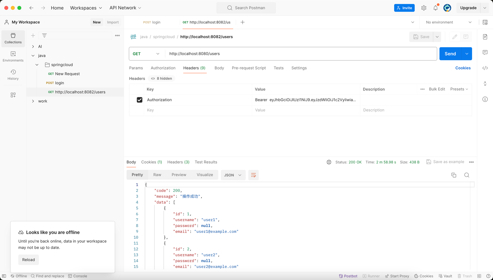

# Spring Cloud Microservices Practice

This is a microservices architecture example project based on Spring Cloud, demonstrating the core components and basic functions of a microservices architecture. The project code is hosted in the [Rodert/SpringCloud-Demo](https://github.com/Rodert/SpringCloud-Demo) repository.

English Version | [中文版](README.md)

## Project Architecture

This project adopts a microservices architecture, including the following components:

- **Gateway Service**: System entry point, responsible for request routing and global authentication
- **Authentication Service**: Provides user authentication and token generation
- **User Service**: Manages user information
- **Order Service**: Manages order information, and calls the User Service via Feign
- **Common Module**: Contains utility classes and entity classes shared by all services

### Component Relationship Diagram

```
┌─────────────┐      ┌─────────────┐
│    Client   │─────▶│  API Gateway│
└─────────────┘      │(8080)       │
                     └──────┬──────┘
                            │
                            ▼
       ┌────────────────────┬────────────────────┐
       │                    │                    │
┌──────▼─────┐      ┌──────▼─────┐      ┌──────▼─────┐
│ Auth Service│      │ User Service│◀─────▶│ Order Service
│ (8081)     │      │ (8082)     │      │ (8083)     │
└──────┬─────┘      └──────┬─────┘      └──────┬─────┘
       │                   │                   │
       └───────────┬───────┴───────────┬───────┘
                   │                   │
           ┌───────▼───────┐   ┌───────▼───────┐
           │  Nacos Registry│   │  Common Module│
           │  (8848)       │   │   (common)    │
           └───────────────┘   └───────────────┘
```

## Technology Stack

- **Spring Boot** 2.6.3: Application foundation framework
- **Spring Cloud** 2021.0.1: Microservices framework
- **Spring Cloud Alibaba** 2021.0.1.0: Alibaba Cloud microservices components
- **Nacos**: Service registration and discovery
- **OpenFeign**: Declarative service calls
- **Spring Cloud Gateway**: API gateway
- **Spring Security**: Authentication and authorization
- **JWT**: Stateless tokens
- **H2 Database**: In-memory database (for development and testing)
- **Spring Data JPA**: Data access layer

## Project Structure

```
spring-cloud-practice/
├── gateway-service/    # Gateway service
├── auth-service/       # Authentication service
├── user-service/       # User service
├── order-service/      # Order service
├── common/             # Common components
└── pom.xml             # Parent POM
```

## Features

1. **Service Registration and Discovery**: All services automatically register and discover through the Nacos registry
2. **Unified Authentication**: JWT-based authentication system, tokens verified uniformly through the gateway
3. **Inter-Service Communication**: Declarative service calls implemented using OpenFeign
4. **Load Balancing**: Client-side load balancing implemented through Spring Cloud LoadBalancer
5. **Circuit Breaking**: Service circuit breaking and degradation using Resilience4j
6. **Data Persistence**: Data access using Spring Data JPA
7. **Security Protection**: Authentication and authorization based on Spring Security

## Quick Start

### Getting the Code

```bash
# Clone the project repository
git clone https://github.com/Rodert/SpringCloud-Demo.git

# Enter the project directory
cd SpringCloud-Demo
```

### Requirements

- JDK 1.8+
- Maven 3.6+
- Docker (recommended for running Nacos service)

### Starting the Services

1. Start the Nacos server

Using Docker, you can quickly start the Nacos service:

```bash
docker run --name nacos-standalone -e MODE=standalone -p 8848:8848 -d nacos/nacos-server:latest
```

The following image shows the Nacos container running in Docker Desktop:


*Figure 1: Nacos container running in Docker Desktop*

Or use local Nacos:

```bash
# Enter the Nacos directory
cd nacos/bin
# Start the server (standalone mode)
sh startup.sh -m standalone
```

2. Build and start each service

```bash
# Build the entire project
mvn clean package -DskipTests

# Start each service in the following order:
# 1. First start the authentication service
java -jar auth-service/target/auth-service-1.0-SNAPSHOT.jar
# 2. Then start the user service
java -jar user-service/target/user-service-1.0-SNAPSHOT.jar
# 3. Then start the order service
java -jar order-service/target/order-service-1.0-SNAPSHOT.jar
# 4. Finally start the gateway service
java -jar gateway-service/target/gateway-service-1.0-SNAPSHOT.jar
```

## Service Discovery

After all microservices start, they automatically register with the Nacos service center. You can view the registered services through the Nacos console.


*Figure 2: Service list in the Nacos console, showing all successfully registered microservices*

## API Documentation

### Authentication Service API

#### User Login
- **URL**: `POST /auth/login`
- **Description**: Verify user credentials and return a JWT token
- **Request Body**:
  ```json
  {
    "username": "user",
    "password": "password"
  }
  ```
- **Response**:
  ```json
  {
    "code": 200,
    "message": "Operation successful",
    "data": {
      "token": "eyJhbGciOiJIUzI1NiJ9..."
    }
  }
  ```

The following image shows the process of calling the login API using Postman and obtaining a JWT token:



*Figure 3: Login API test and JWT token generation*

### User Service API

#### Get All Users
- **URL**: `GET /users`
- **Description**: Returns a list of all users in the system
- **Request Header**: `Authorization: Bearer {token}`
- **Response**:
  ```json
  {
    "code": 200,
    "message": "Operation successful",
    "data": [
      {
        "id": 1,
        "username": "user1",
        "email": "user1@example.com"
      },
      {
        "id": 2,
        "username": "user2",
        "email": "user2@example.com"
      }
    ]
  }
  ```

The following image shows successfully accessing the user service using a JWT token:


*Figure 4: Accessing the User Service API using a JWT token*

#### Get User by ID
- **URL**: `GET /users/{id}`
- **Description**: Returns detailed information of the user with the specified ID
- **Request Header**: `Authorization: Bearer {token}`
- **Response**:
  ```json
  {
    "code": 200,
    "message": "Operation successful",
    "data": {
      "id": 1,
      "username": "user1",
      "email": "user1@example.com"
    }
  }
  ```

#### Search Users
- **URL**: `GET /users/search?keyword={keyword}`
- **Description**: Search for users based on the keyword
- **Request Header**: `Authorization: Bearer {token}`

### Order Service API

#### Get All Orders
- **URL**: `GET /orders`
- **Description**: Returns a list of all orders in the system
- **Request Header**: `Authorization: Bearer {token}`

#### Get Order Details
- **URL**: `GET /orders/{id}`
- **Description**: Returns detailed information of the order with the specified ID, including associated user information
- **Request Header**: `Authorization: Bearer {token}`
- **Response**:
  ```json
  {
    "code": 200,
    "message": "Operation successful",
    "data": {
      "id": 1,
      "userId": 1,
      "productName": "iPhone 13",
      "quantity": 1,
      "amount": 6999,
      "createTime": "2023-01-01T12:00:00",
      "user": {
        "id": 1,
        "username": "user1",
        "email": "user1@example.com"
      }
    }
  }
  ```

#### Get User Orders
- **URL**: `GET /orders/user/{userId}`
- **Description**: Returns all orders of the specified user
- **Request Header**: `Authorization: Bearer {token}`

#### Create Order
- **URL**: `POST /orders`
- **Description**: Create a new order
- **Request Header**: `Authorization: Bearer {token}`
- **Request Body**:
  ```json
  {
    "userId": 1,
    "productName": "MacBook Pro",
    "quantity": 1,
    "amount": 12999
  }
  ```

### Testing APIs (Command Line Method)

In addition to using Postman, you can also use curl commands to test the APIs:

1. Get a token

```bash
curl -X POST http://localhost:8080/auth/login \
  -H "Content-Type: application/json" \
  -d '{"username":"user","password":"password"}'
```

2. Access the user service using the token

```bash
curl -X GET http://localhost:8080/users \
  -H "Authorization: Bearer {YOUR_TOKEN}"
```

3. Get an order including user information

```bash
curl -X GET http://localhost:8080/orders/1 \
  -H "Authorization: Bearer {YOUR_TOKEN}"
```

## Configuration Details

Main configuration items for each service:

### Authentication Service

```yaml
server:
  port: 8081  # Service port

spring:
  application:
    name: auth-service  # Service name
  datasource:
    url: jdbc:h2:mem:authdb  # H2 in-memory database
    driver-class-name: org.h2.Driver
    username: sa
    password:
  jpa:
    database-platform: org.hibernate.dialect.H2Dialect
    hibernate:
      ddl-auto: update  # Automatically update the table structure
  cloud:
    nacos:
      discovery:
        server-addr: 127.0.0.1:8848  # Nacos server address

jwt:
  secret: mySecretKey  # JWT signature key
  expiration: 86400    # Token expiration time (seconds)
```

### User Service

```yaml
server:
  port: 8082  # Service port

spring:
  application:
    name: user-service  # Service name
  cloud:
    nacos:
      discovery:
        server-addr: 127.0.0.1:8848  # Nacos server address
```

### Order Service

```yaml
server:
  port: 8083  # Service port

spring:
  application:
    name: order-service  # Service name
  cloud:
    nacos:
      discovery:
        server-addr: 127.0.0.1:8848  # Nacos server address

feign:
  client:
    config:
      default:
        connectTimeout: 5000  # Connection timeout (milliseconds)
        readTimeout: 5000     # Read timeout (milliseconds)
```

### Gateway Service

```yaml
server:
  port: 8080  # Service port

spring:
  application:
    name: gateway-service  # Service name
  cloud:
    nacos:
      discovery:
        server-addr: 127.0.0.1:8848  # Nacos server address
    gateway:
      routes:  # Route configuration
        - id: auth-service
          uri: lb://auth-service
          predicates:
            - Path=/auth/**
        - id: user-service
          uri: lb://user-service
          predicates:
            - Path=/users/**
        - id: order-service
          uri: lb://order-service
          predicates:
            - Path=/orders/**
```

## Troubleshooting

### Service Fails to Start
- **Problem**: Port occupation error when starting the application
- **Solution**: Check if the specified port is already occupied by another application, or modify the port number in the configuration

### Service Cannot Register with Nacos
- **Problem**: Service starts successfully but cannot be seen in the Nacos console
- **Solution**:
  1. Confirm that the Nacos server is running normally
  2. Check if the Nacos address in the configuration file is correct
  3. Check if the `@EnableDiscoveryClient` annotation is added to the application main class
  4. Check if the network connection is normal

### Authentication Failure
- **Problem**: Authentication fails when logging in
- **Solution**:
  1. Confirm that the username and password are correct
  2. Check the `SecurityConfig` configuration
  3. Confirm that the `UserDetailsService` implementation is correct

### Inter-Service Call Failure
- **Problem**: Order service cannot call user service
- **Solution**:
  1. Confirm that both services are registered with Nacos
  2. Check if the Feign client interface is correctly defined
  3. Confirm that the target service name is consistent with the name registered with Nacos

### Database Connection Issues
- **Problem**: Database connection error when starting the application
- **Solution**:
  1. Confirm that the H2 database configuration is correct
  2. Check if the JPA entity class annotations are correct

## Development Guide

### Adding a New Service
1. Create a new Maven module
2. Add necessary dependencies (such as Spring Boot, Spring Cloud, Nacos, etc.)
3. Create the application main class and add `@SpringBootApplication` and `@EnableDiscoveryClient` annotations
4. Create the application.yml configuration file, configure the service name, port, and Nacos address
5. Develop business logic (controllers, services, data access layer, etc.)
6. Modify gateway configuration, add routing rules for the new service

### Adding a New API
1. Define a new API method in the controller
2. Add appropriate request mapping annotations (such as `@GetMapping`, `@PostMapping`, etc.)
3. Implement business logic
4. Use `Result<T>` to wrap response data, ensuring a unified response format

### Inter-Service Communication
1. Add OpenFeign dependency to the calling service
2. Create a Feign client interface, add the `@FeignClient` annotation
3. Define the remote methods to be called in the interface
4. Add the `@EnableFeignClients` annotation to the main class
5. Inject the Feign client and call its methods

## Extensions and Improvements

The following features can be added to further enhance the system:

1. **Configuration Center**: Add Nacos or Spring Cloud Config as a configuration center
2. **Service Monitoring**: Integrate Spring Boot Admin or Prometheus+Grafana
3. **Distributed Tracing**: Integrate Sleuth and Zipkin
4. **Message Queue**: Add RabbitMQ or Kafka for asynchronous communication
5. **Database**: Replace in-memory simulated data with a real database
6. **Distributed Transactions**: Integrate Seata to manage cross-service transactions
7. **API Documentation**: Integrate Swagger or SpringDoc to automatically generate API documentation
8. **Rate Limiting and Circuit Breaking**: Enhance rate limiting, circuit breaking, and degradation capabilities of gateways and services

## Contribution Guidelines

Feel free to submit issues and feature requests, or directly submit Pull Requests.

1. Fork the [Rodert/SpringCloud-Demo](https://github.com/Rodert/SpringCloud-Demo) repository
2. Create your feature branch (`git checkout -b feature/amazing-feature`)
3. Commit your changes (`git commit -m 'Add some amazing feature'`)
4. Push to the branch (`git push origin feature/amazing-feature`)
5. Open a Pull Request

## License

This project is licensed under the Apache-2.0 License - see the [LICENSE](LICENSE) file for details

## About

SpringCloud-Demo is an entry-level project for Spring Cloud. If you want to build your own Spring Cloud system, you can refer to this. This project aims to provide a complete microservices architecture example to help developers quickly understand and apply the Spring Cloud technology stack. 